<p align="center">
  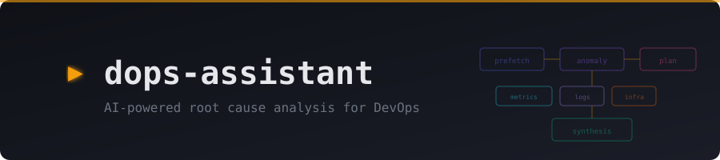
</p>

<p align="center">
  <a href="https://wz.github.io/dops-assistant/"></a>
  <a href="LICENSE"></a>
  = 20"/>
  
</p>

<p align="center">
  <strong>👉 <a href="https://wz.github.io/dops-assistant/">Try the live demo</a></strong> — read-only, seeded with realistic incidents, no signup
</p>

AI-powered incident response for DevOps teams. Connects to your monitoring stack via [MCP](https://modelcontextprotocol.io/) to investigate incidents, scan for problems before they alert, and deliver structured RCA reports with evidence — automatically. Skip the part where you tab between five dashboards at 3am trying to figure out what broke.

<p align="center">
  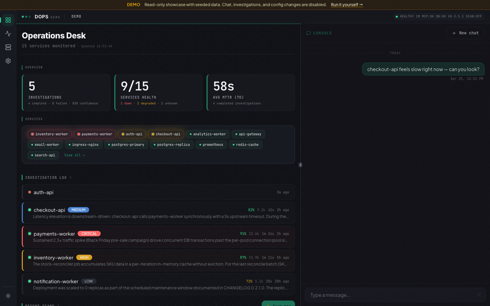
</p>

<p align="center"><em>The Operations Desk — live service catalog, investigation log, recent scan runs, and event rail in one view.</em></p>

## Features

- **Automated RCA pipeline** — 6-phase investigation: prefetch → anomaly detection → planning → parallel evidence gathering (metrics + logs + infra + changes) → synthesis → report
- **Proactive scanning** — cron-driven probe evaluates PromQL and LogQL rules across every configured service and kicks off headless investigations when thresholds trip. Four-track evaluator covers availability, pod-restart storms, log-error bursts, and custom rules
- **AI service discovery** — guided setup wizard walks your Prometheus and Loki stack, with live progress (discover → validate → review) and a one-click **Accept** to populate the service catalog with canonical metrics, log labels, and per-service + stack-wide probe rules. Headless `npm run discover` available for CI
- **MCP-agnostic providers** — pluggable architecture. Wire in Grafana, Kubernetes, GitLab, Coroot, or any MCP-compatible backend and assign roles (metrics, logs, infrastructure, changes, dependencies) in config
- **Four trigger sources** — operator messages in chat, Alertmanager webhooks, health-poller transitions, and scheduled scans
- **Notifications** — deliver every completed investigation to Slack and/or email. Per-recipient severity threshold and source allowlist (webhook / scan / poller / manual). Teams-safe HTML email
- **Operations Desk** — live catalog of services with health chips, investigation stream, recent scan runs, and an event rail in one view
- **Activity center** — unified `/activity` route with four tabs (Investigations, Scans, Patterns, Events). Shared filter-bar idiom, URL-driven state, paginated history, and a 30-day persistent event feed
- **Multi-stack** — run prod, staging, and dev side-by-side in one deployment. Each stack has its own providers, services, probe rules, and investigation history
- **Web UI + CLI** — real-time progress over WebSocket, or a terminal REPL (Ink) with tool call visibility
- **LLM resilience** — every model call retries with exponential backoff on transient provider blips (HTTP 408/409/429/5xx, connection errors). When the LLM stays down, investigations fail loudly with the actual reason instead of spinning forever. Tunable via `llm.retry` in config
- **Deploy anywhere** — single Docker image, Helm chart for Kubernetes, or run `npm run web` behind your own process manager

## Quick Start

```bash
npm install
cp config.yaml.example config.yaml   # then edit
export OPENAI_API_KEY=sk-...
npm run web                           # port 3000
```

Open `http://localhost:3000`. The setup wizard walks you through **Connect Provider → Discover Services → Monitor** — point it at your Grafana MCP server and the AI populates the service catalog from your Prometheus labels. Headless equivalent: `npm run discover`.

For the full configuration reference (providers, scan rules, webhooks, notifications, SMTP), see the **[Ops Runbook](docs/runbook.md)** or [`config.yaml.example`](config.yaml.example).

## How It Works

User messages are classified by an intent router. Questions go to a chat agent; incident reports trigger the investigation workflow.

<p align="center">
  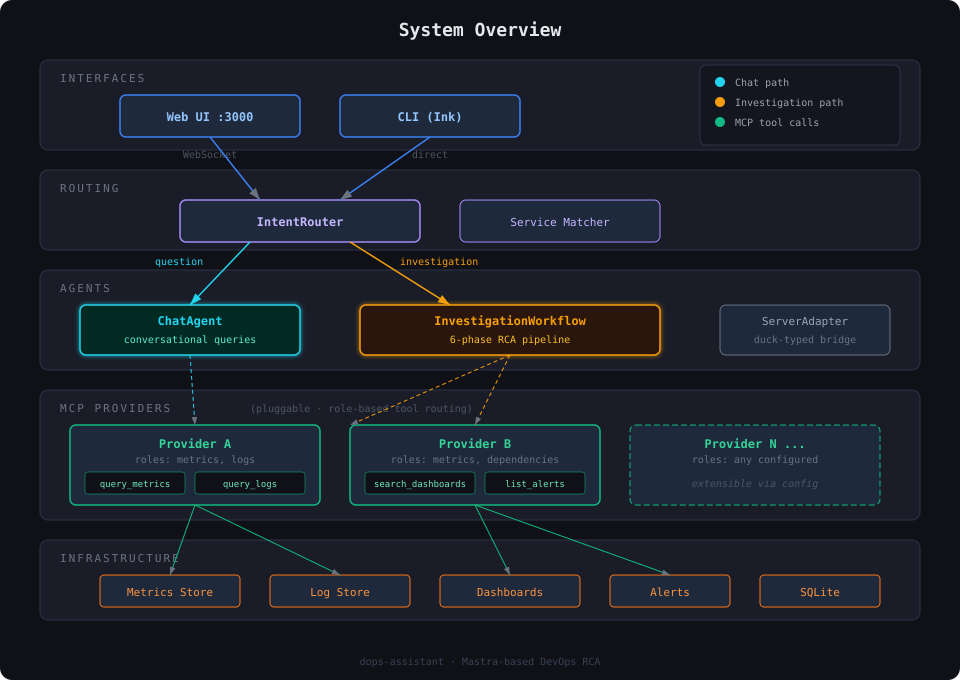
</p>

### Investigation Pipeline

Six phases. Evidence gathering (metrics, logs, infra, changes) runs in parallel for speed. Each agent gets only the MCP tools relevant to its role, so the metrics agent never sees log query tools and vice versa.

<p align="center">
  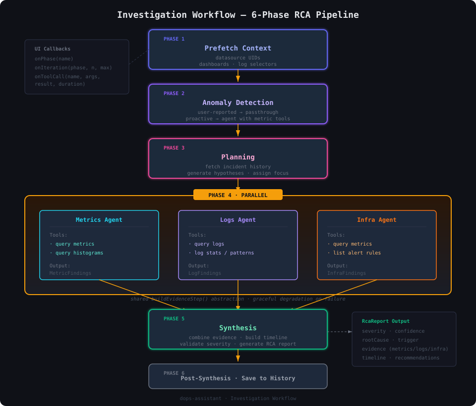
</p>

## Triggers

Investigations can start four ways.

### 1. Operator (Web UI or CLI)

Type a message like `admin-task is returning 500 errors since 4pm`. The intent router detects an incident report and launches the full investigation pipeline with your message as context. Results stream back in real time.

### 2. Alert Webhook (Alertmanager)

Point [Alertmanager](https://prometheus.io/docs/alerting/latest/alertmanager/) at `POST /api/webhook/alert`. The handler validates the bearer token, dedups recent alerts, extracts service/severity/labels, merges with the service's known metrics and log selectors from `services.yaml`, and runs a headless investigation.

```yaml
# alertmanager.yml
receivers:
  - name: dops
    webhook_configs:
      - url: http://dops-assistant:3000/api/webhook/alert
        http_config:
          bearer_token: "<your-token>"
```

Investigation depth (quick / standard / full) can be mapped per severity in config.

### 3. Health Poller

A background poller queries Prometheus every 60 seconds for deployment replica counts and `up` metrics. When a service transitions from healthy to down it auto-fires a quick investigation. No extra config — the poller uses the service registry and each service's known selectors.

### 4. Proactive Scan

A cron-scheduled probe walks every service on the cadence you set and evaluates four tracks of rules:

1. **Global rules** — stack-wide availability written by the discovery agent, aware of whichever label key your stack actually uses (`app`, `service`, `job`, `deployment`)
2. **Per-service metric rules** — discovery-written thresholds like pod-restart storms, using each service's real Kubernetes namespace
3. **Per-service log rules** — LogQL `count_over_time(... |= error)` scoped to the service's real Loki labels
4. **Config-file defaults** — hardcoded fallback rules from `config.yaml` when discovery hasn't run

Each rule has hysteresis (consecutive-tick counters) so a single flap doesn't fire a scan. When a rule trips, the probe spawns a headless investigation and the scan run lands on the Operations Desk with status, phase breakdown, and links to each child investigation.

Every tick creates a durable `ScanRun` record at `/scan/runs/:id` — copy the link, download as PNG or Markdown, or fire it to Slack with one click.

<p align="center">
  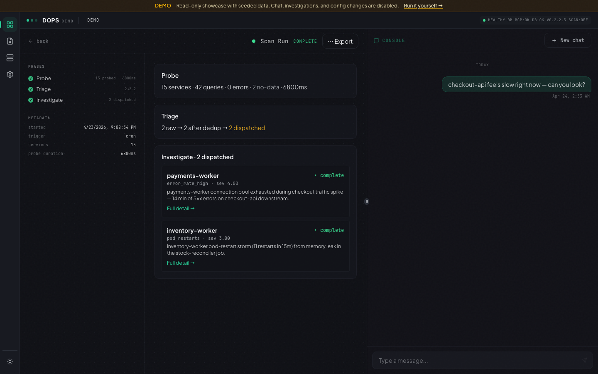
</p>

<p align="center"><em>A scan run that dispatched two investigations — the 3-phase probe/triage/investigate breakdown is preserved forever.</em></p>

| Trigger | Context | Depth | Requires |
|---|---|---|---|
| Operator | High (natural language + time refs) | Configurable | Nothing extra |
| Alert webhook | Medium (alert labels + service config) | Per-severity template | Alertmanager config |
| Health poller | Medium (transition info + service config) | Quick | Prometheus provider |
| Proactive scan | Medium (rule trigger + service config) | Configurable per rule | `scan.enabled: true` |

## Investigations

Every investigation gets a shareable URL, a phase rail that streams live, and a structured RCA report with root cause, contributing factors, timeline, evidence (metrics + logs + infra + changes), and recommended actions.

<p align="center">
  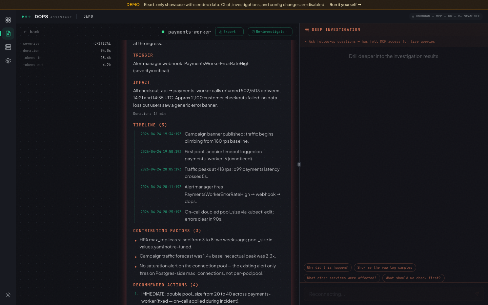
</p>

## Activity

Everything that happens in the system — investigations, scan runs, learned patterns, and lifecycle events — lives under a single `/activity` route, split into four tabs that share a filter-bar idiom (search, severity pills, status toggles, time-window shortcuts, URL-driven state).

**Investigations** — every investigation, filterable by severity / status / service / time. URL-driven filters mean bookmarks and browser history Just Work.

<p align="center">
  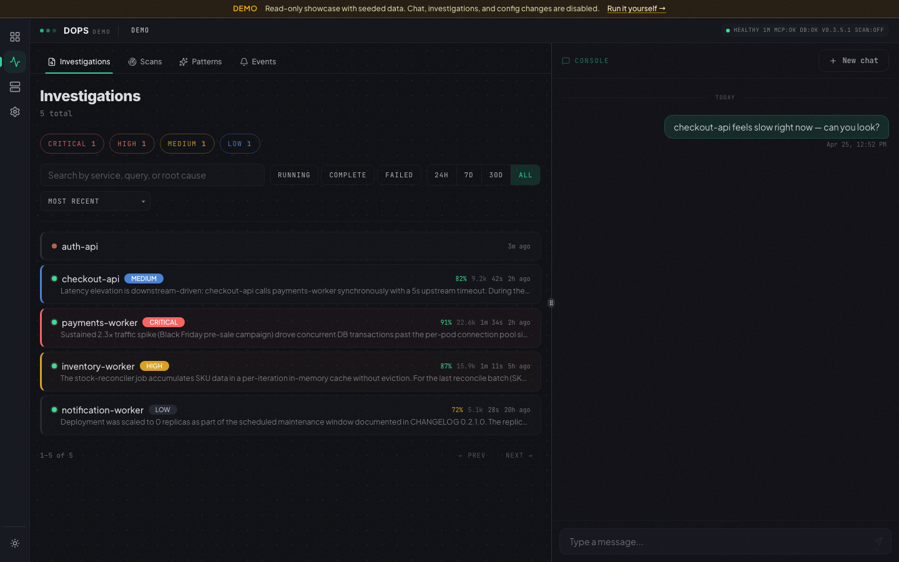
</p>

**Scans** — every probe tick the scheduler ran, with trigger (cron / manual / webhook), status, hits dispatched, and a deep link to each run's Probe → Triage → Investigate breakdown. Click into a run from anywhere it's referenced.

<p align="center">
  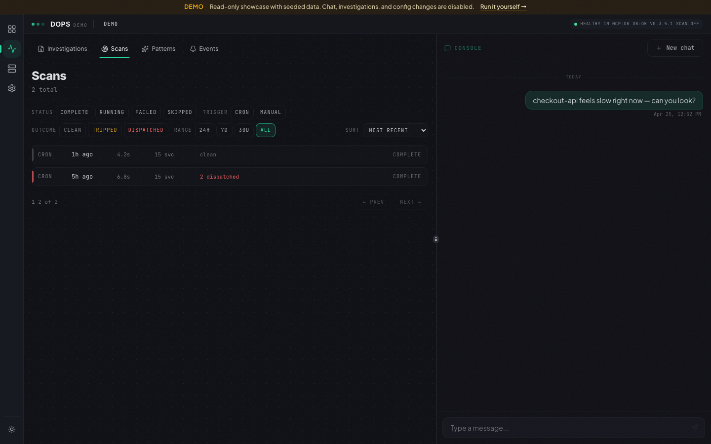
</p>

**Patterns** — the learned-pattern catalog. Every confirmed RCA contributes to a service's pattern library, scoped by severity + service, with drill-down to the source investigation that taught it.

<p align="center">
  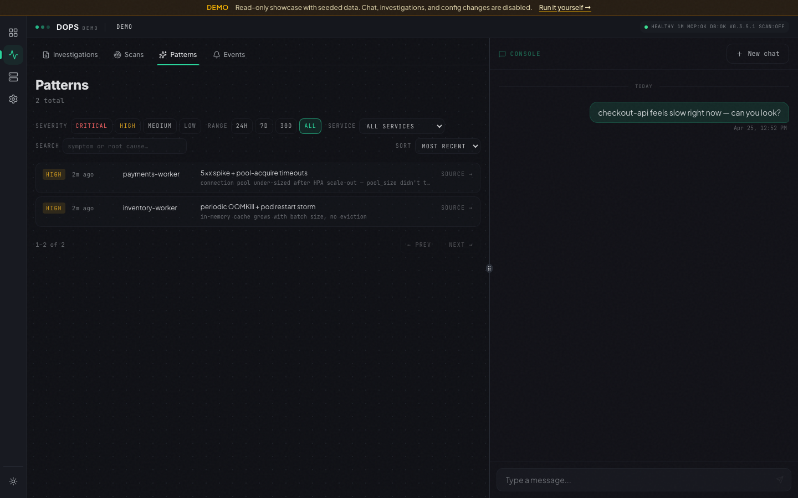
</p>

**Events** — the persistent system feed. Investigation lifecycle (`investigation_started` / `_completed` / `_failed`), alert webhooks, scan-run completions, manual scan triggers, and provider health crossings — all backed by a 30-day retention window and filterable by kind / severity / service / time.

<p align="center">
  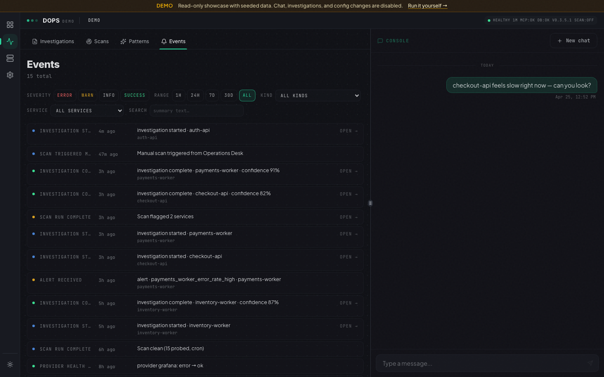
</p>

## Notifications

Every completed investigation can be delivered to Slack and email. Recipients are filtered independently on two axes — minimum severity and allowed trigger source — so each inbox only sees what it wants.

**Slack** (via incoming webhook): per-investigation summary posts, plus optional run-level scan summaries (`always` / `hits-only` / `off`).

**Email** (via SMTP): Teams-safe HTML body that renders the full RCA report — severity banner, summary, root cause with confidence, contributing factors, timeline, evidence (metrics + logs + infra + changes), recommended actions, and a deep link back to the investigation. Plain-text fallback included. Works with Microsoft Teams channel email addresses.

Manage recipients at **Settings → Notifications** in the UI — add, edit, toggle, and send a fixture RCA through the real pipeline with the per-row **Test** button.

<p align="center">
  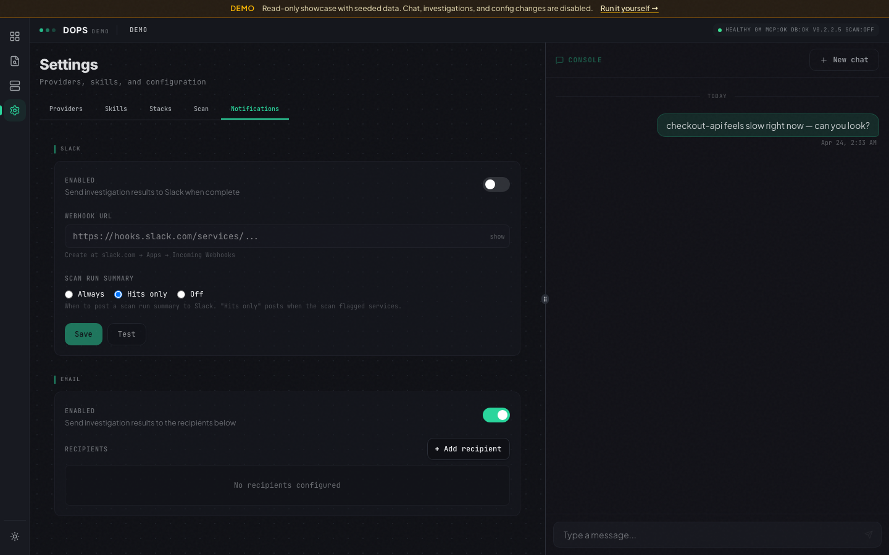
</p>

## Operations Desk

The default landing page is a live SOC-style console: health strip, service catalog with status chips, investigation log, recent scan runs with a one-click **Scan now** button, and an event stream rail. Drilling into a service opens a tabbed detail view (metrics, history, dependencies, AI brief).

## Try It

**Live demo: [wz.github.io/dops-assistant](https://wz.github.io/dops-assistant/)** — fully interactive, hosted on GitHub Pages, no signup. Click into any investigation, browse the service catalog, drill into a scan run. Mutations are disabled (it's static), but every read path is real.

Want to run the same thing yourself?

**Locally (Node server):**

```bash
npm install
npm run seed:demo           # writes fixture data to data-demo/
npm run demo                # boots with DEMO_MODE=true on port 3000
```

**As a static site (GitHub Pages — zero infra, zero cost):**

```bash
npm run build:demo-static   # SPA + seed + static JSON snapshots
npx serve dist/web --single # any static server works
```

The static build is what the `deploy-demo` GitHub Actions workflow ships to Pages — see [`demo/README.md`](demo/README.md) for the one-time setup (a single toggle: Settings → Pages → Source: GitHub Actions). All mutating endpoints are disabled, no LLM calls are made, and no real infrastructure is touched.

## Deployment

- **Docker** — single image, mount `config.yaml` and `services.yaml`, pass `OPENAI_API_KEY`
- **Helm** — chart at [`deploy/helm/dops-assistant`](deploy/helm/dops-assistant). Supports sub-path ingress via `APP_BASE_PATH`, SMTP creds via `extraEnvFrom` on an existing Secret, and ingress WebSocket timeout annotations for the ~60s LLM silent-thinking phase
- **Process manager** — `npm run build:web && npm run web` behind systemd, pm2, or your stack of choice

## Documentation

- **[Architecture Overview](docs/architecture-overview.md)** — system design, component details, data flow, design decisions
- **[Ops Runbook](docs/runbook.md)** — MCP setup, full config reference, tuning, troubleshooting
- **[Email Notifications Setup](docs/email-notifications-setup.md)** — SMTP, Teams tenant rules, GUI walkthrough
- **[Provider YAML Spec](docs/provider-yaml-spec.md)** — writing custom MCP providers
- **[Changelog](CHANGELOG.md)** — release history

## Development

```bash
npm run web                 # web server (loads dev/.env, port 3000)
npm run cli                 # terminal REPL
npm run build:web           # build frontend (Vite → dist/web/)
npm run discover            # run AI service discovery
npm run test:discover-eval  # score discovery output quality (CI gates at 75/100)
npx tsx src/eval/rca-eval.ts   # score RCA report quality
npx vitest run              # run tests (100+ files)
npx tsc --noEmit            # type check
```

## Contributing

Contributions welcome. Please open an issue first to discuss what you'd like to change.

## License

[MIT](LICENSE)
