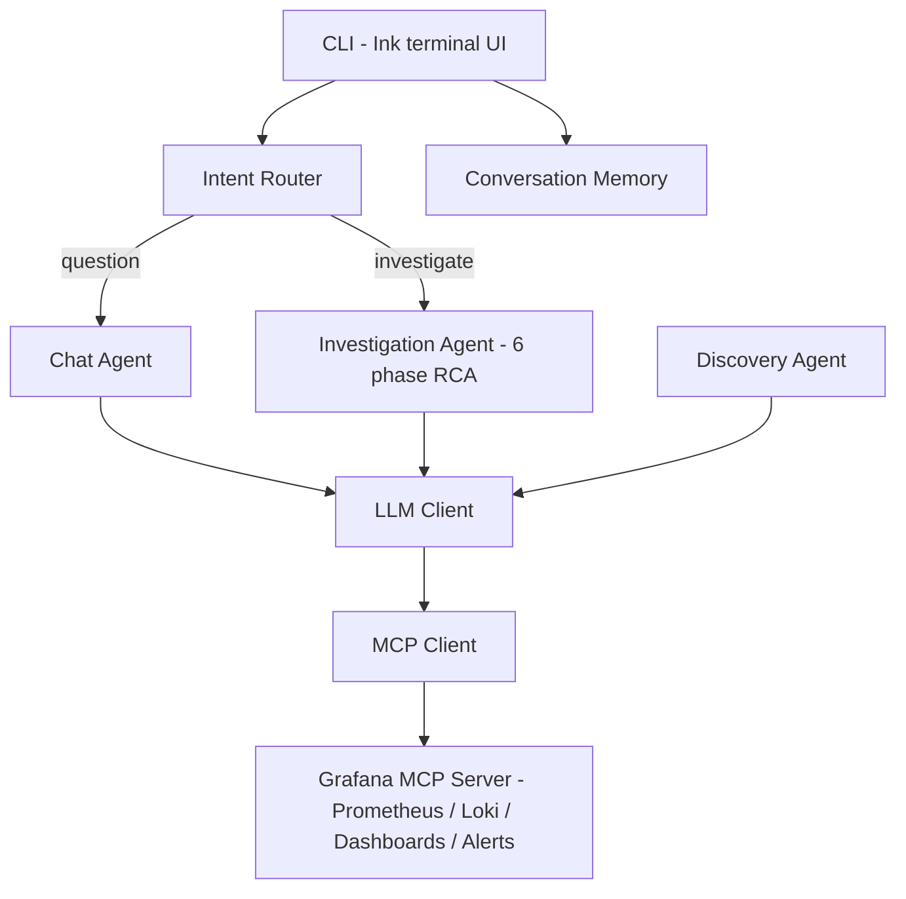

# dops-assistant

An agentic DevOps assistant that connects to Grafana via MCP, performs autonomous root cause analysis, and serves as a conversational ops assistant through a terminal CLI.

## Features

- **Agentic RCA** — 6-phase investigation pipeline: anomaly detection, planning, parallel evidence gathering (metrics + logs + infra), timeline correlation, chain-of-thought synthesis, and self-validation
- **Conversational assistant** — ask questions and get metric values, log excerpts, dashboard links, and ad-hoc Grafana panels
- **Intent routing** — classifies user messages and routes to the investigation agent or conversation agent
- **Service auto-discovery** — discovers services from Consul/Prometheus, probes for RED metrics and Loki log labels
- **Panel capture** — automatically screenshots relevant dashboard panels and attaches them to reports

---

## Architecture



---

## RCA Investigation Pipeline

The investigation agent runs a multi-phase pipeline applying agentic design patterns:

```
  User message: "investigate spike in ingestion rate on March 3"
                                │
                                ▼
┌─────────────────────────────────────────────────────────────────────┐
│  PRE-FETCH (deterministic, no LLM)                                  │
│                                                                     │
│  Parallel MCP calls to front-load context:                          │
│   • getDatasourceHint()      → Prometheus/Loki UIDs                 │
│   • getPanelQueriesContext()  → PromQL from relevant dashboards     │
│   • getLokiLabelsHint()      → available Loki label names           │
│   • getWorkingLogSelector()  → probes Loki to find a selector       │
│                                that actually returns logs           │
│                                                                     │
│  Purpose: eliminate 2-3 discovery iterations from evidence phases   │
└─────────────────────────────────────────────────────────────────────┘
                                │
                                ▼
┌─────────────────────────────────────────────────────────────────────┐
│  PHASE 1: ANOMALY DETECTION + TIME EXTRACTION                       │
│                                                                     │
│  Two paths:                                                         │
│                                                                     │
│  A) User-reported issue (most common):                              │
│     ┌──────────────────────────────────────────┐                    │
│     │  🤖 LLM call: extractTimeRangeViaLlm()   │                    │
│     │                                          │                    │
│     │  Input:  user message (natural language) │                    │
│     │  Output: {from, to} as ISO timestamps    │                    │
│     │  Tokens: ~128 (lightweight, no tools)    │                    │
│     └──────────────────────────────────────────┘                    │
│     Skips full anomaly detection — trusts the user.                 │
│                                                                     │
│  B) Proactive mode (no user message):                               │
│     ┌──────────────────────────────────────────┐                    │
│     │  🤖 LLM call: runPhase (7 iterations)    │                    │
│     │                                          │                    │
│     │  System: "Check services for anomalies"  │                    │
│     │  Tools:  query_prometheus, query_loki,   │                    │
│     │          search_dashboards, etc.         │                    │
│     │  Output: AnomalyAssessment JSON          │                    │
│     │          {isAnomaly, severity, summary,  │                    │
│     │           timeRangeFrom, timeRangeTo}    │                    │
│     └──────────────────────────────────────────┘                    │
│     If isAnomaly=false → early exit, return "no anomaly" report     │
└─────────────────────────────────────────────────────────────────────┘
                                │
                                ▼
┌─────────────────────────────────────────────────────────────────────┐
│  PHASE 1.5: INVESTIGATION PLANNING                                  │
│  ┌──────────────────────────────────────────────┐                   │
│  │  🤖 LLM call: runPhase (3 iters, NO tools)   │                   │
│  │                                              │                   │
│  │  Input:  service name, anomaly summary,      │                   │
│  │          severity, metrics, log labels       │                   │
│  │  Output: InvestigationPlan JSON              │                   │
│  │          {hypotheses[],                      │                   │
│  │           metricFocus[], logFocus[],         │                   │
│  │           infraFocus[]}                      │                   │
│  └──────────────────────────────────────────────┘                   │
│  Pure reasoning — generates hypotheses and focus areas              │
│  that guide the 3 evidence phases below.                            │
└─────────────────────────────────────────────────────────────────────┘
                                │
                                ▼
┌─────────────────────────────────────────────────────────────────────┐
│  PHASES 2/3/4 + PANEL CAPTURE  (all 4 run in PARALLEL)              │
│                                                                     │
│  ┌─────────────────────┐  ┌─────────────────────┐                   │
│  │  PHASE 2: METRICS   │  │  PHASE 3: LOGS      │                   │
│  │  🤖 LLM (6 iters)  │  │  🤖 LLM (6 iters)    │                   │
│  │                     │  │                     │                   │
│  │  Tools:             │  │  Tools:             │                   │
│  │  • query_prometheus │  │  • query_loki_logs  │                   │
│  │  • get_panel_image  │  │  • get_panel_image  │                   │
│  │                     │  │                     │                   │
│  │  Context injected:  │  │  Context injected:  │                   │
│  │  • PromQL from      │  │  • Validated log    │                   │
│  │    dashboard panels │  │    selector         │                   │
│  │  • Datasource UIDs  │  │  • Loki label names │                   │
│  │  • Time window      │  │  • Time window      │                   │
│  │  • Plan focus areas │  │  • Plan focus areas │                   │
│  │                     │  │                     │                   │
│  │  Output:            │  │  Output:            │                   │
│  │  MetricFindings     │  │  LogFindings        │                   │
│  │  {observations[],   │  │  {observations[],   │                   │
│  │   anomalyWindow,    │  │   summary}          │                   │
│  │   summary}          │  │  + sampleLines[]    │                   │
│  └─────────────────────┘  └─────────────────────┘                   │
│                                                                     │
│  ┌─────────────────────┐  ┌─────────────────────┐                   │
│  │  PHASE 4: INFRA     │  │  PANEL CAPTURE      │                   │
│  │  🤖 LLM (6 iters)  │  │  (no LLM)            │                   │
│  │                     │  │                     │                   │
│  │  Tools:             │  │  Deterministic:     │                   │
│  │  • query_prometheus │  │  • search_dashboards│                   │
│  │  • get_panel_image  │  │  • get_dashboard    │                   │
│  │                     │  │  • get_panel_image  │                   │
│  │  Checks:            │  │                     │                   │
│  │  • Pod restarts     │  │  Ranks dashboards   │                   │
│  │  • CPU/memory       │  │  by service name,   │                   │
│  │  • OOMKilled        │  │  captures top 3     │                   │
│  │  • CrashLoopBackOff │  │  panels with the    │                   │
│  │                     │  │  correct time range │                   │
│  │  Output:            │  │                     │                   │
│  │  InfraFindings      │  │  Output:            │                   │
│  │  {observations[],   │  │  PanelImage[]       │                   │
│  │   summary}          │  │  (binary PNG data)  │                   │
│  └─────────────────────┘  └─────────────────────┘                   │
│                                                                     │
│  Each evidence LLM phase:                                           │
│   • Iterations 0-3: tools available (4 productive rounds)           │
│   • Iteration 3: midpoint nudge ("start wrapping up")               │
│   • Iterations 4-5: wind-down, tools withheld, force JSON output    │
│   • If exhausted: forced JSON extraction via fresh summarization    │
└─────────────────────────────────────────────────────────────────────┘
                                │
                                ▼
┌─────────────────────────────────────────────────────────────────────┐
│  TIMELINE CONSTRUCTION (deterministic, no LLM)                      │
│                                                                     │
│  buildTimeline() merges timestamped observations from all 3         │
│  evidence phases, sorts chronologically → text timeline             │
└─────────────────────────────────────────────────────────────────────┘
                                │
                                ▼
┌─────────────────────────────────────────────────────────────────────┐
│  PHASE 5: SYNTHESIS                                                 │
│  ┌──────────────────────────────────────────────┐                   │
│  │  🤖 LLM call: runPhase (3 iters, NO tools)   │                   │
│  │                                              │                   │
│  │  Input:                                      │                   │
│  │  • Condensed metric findings + raw data pts  │                   │
│  │  • Condensed log findings + sample lines     │                   │
│  │  • Condensed infra findings                  │                   │
│  │  • Chronological timeline                    │                   │
│  │  • Investigation hypotheses from plan        │                   │
│  │  • Real dashboard URLs                       │                   │
│  │                                              │                   │
│  │  Reasoning: correlate → hypothesize →        │                   │
│  │             validate → conclude              │                   │
│  │                                              │                   │
│  │  Output: RCA Report JSON                     │                   │
│  │  {severity, summary, rootCause,              │                   │
│  │   evidence{metrics[], logs[], infra[]},      │                   │
│  │   dashboardLinks[], recommendedActions[],    │                   │
│  │   confidence}                                │                   │
│  └──────────────────────────────────────────────┘                   │
└─────────────────────────────────────────────────────────────────────┘
                                │
                                ▼
┌─────────────────────────────────────────────────────────────────────┐
│  PHASE 6: REFLECTION                                                │
│  ┌──────────────────────────────────────────────┐                   │
│  │  🤖 LLM call: runPhase (3 iters, NO tools)   │                   │
│  │                                              │                   │
│  │  Input: synthesis report + phase summaries   │                   │
│  │                                              │                   │
│  │  Checks:                                     │                   │
│  │  • Does root cause explain all symptoms?     │                   │
│  │  • Is severity consistent with evidence?     │                   │
│  │  • Contradictory evidence ignored?           │                   │
│  │  • Are actions specific & actionable?        │                   │
│  │                                              │                   │
│  │  Output: ReflectionResult JSON               │                   │
│  │  {revisedSeverity, revisedRootCause,         │                   │
│  │   revisedSummary, revisedConfidence,         │                   │
│  │   issues[]}                                  │                   │
│  └──────────────────────────────────────────────┘                   │
└─────────────────────────────────────────────────────────────────────┘
                                │
                                ▼
┌─────────────────────────────────────────────────────────────────────┐
│  POST-PROCESSING (deterministic, no LLM)                            │
│                                                                     │
│  • Apply reflection corrections (severity, root cause, summary)     │
│  • validateSeverity() — deterministic guardrail catches             │
│    severity/evidence mismatches that both LLM phases missed         │
│  • Override dashboardLinks with real URLs from pre-fetch            │
│  • Cap arrays (max 5 per evidence category)                         │
│  • Attach panel images                                              │
│                                                                     │
│  Output: final RcaReport                                            │
└─────────────────────────────────────────────────────────────────────┘
```

### LLM calls per phase

| Phase | LLM? | Tools? | Iterations | Purpose |
|-------|------|--------|------------|---------|
| Pre-fetch | No | MCP only | — | Front-load datasource UIDs, panel queries, Loki labels, log selector |
| 1: Anomaly | Yes (lightweight) | No | 1 shot | Extract time range from natural language |
| 1.5: Planning | Yes | No | 3 | Generate hypotheses and focus areas |
| 2: Metrics | Yes | Yes (Prometheus) | 6 | Query metrics, find anomalous values |
| 3: Logs | Yes | Yes (Loki) | 6 | Query logs, capture error patterns + sample lines |
| 4: Infra | Yes | Yes (Prometheus) | 6 | Check CPU, memory, pod restarts, OOM |
| Panel capture | No | MCP only | — | Deterministic image capture from ranked dashboards |
| Timeline | No | — | — | Sort observations chronologically |
| 5: Synthesis | Yes | No | 3 | Correlate all evidence → root cause + report |
| 6: Reflection | Yes | No | 3 | Self-review: catch severity/evidence mismatches |
| Post-processing | No | — | — | Apply corrections, cap arrays, attach images |

Phases 2, 3, 4, and panel capture run **in parallel** — that's the main efficiency win. The 3 evidence LLM phases are isolated from each other (zero shared context), which is why synthesis exists: to merge and reason across all evidence.

### How pre-fetch relates to the discovery agent

Two separate processes feed into the investigation pipeline:

```
┌─────────────────────────────────────────┐
│            DISCOVERY AGENT              │
│        (runs once, ahead of time)       │
│                                         │
│  Uses LLM + MCP to find services:       │
│  • query_prometheus → metric names      │
│  • list_loki_label_values → log labels  │
│                                         │
│  Output: ServiceConfig[]                │
│    { name, metrics[], logLabels{} }     │
└────────────────┬────────────────────────┘
                 │
                 ▼
       config.yaml (persisted)
                 │
                 ▼
┌────────────────────────────────────────────┐
│  investigate(service, userMessage)         │
│                                            │
│  ┌──────────────────────────────────────┐  │
│  │    INVESTIGATION PRE-FETCH           │  │
│  │  (runs every investigation, no LLM)  │  │
│  │                                      │  │
│  │  Queries MCP for live context:       │  │
│  │  • list_datasources                  │  │
│  │    → Prometheus/Loki UIDs            │  │
│  │  • search_dashboards                 │  │
│  │    + get_dashboard_panel_queries     │  │
│  │    → PromQL from dashboard panels    │  │
│  │  • list_loki_label_names             │  │
│  │    → available log labels            │  │
│  │  • query_loki_logs (limit=1)         │  │
│  │    → probe selectors until one works │  │
│  └──────────────┬───────────────────────┘  │
│                 │                          │
│                 ▼                          │
│   ServiceConfig + live MCP context         │
│   merged into phase prompts                │
│                 │                          │
│                 ▼                          │
│  [ evidence phases → synthesis → report ]  │
└────────────────────────────────────────────┘
```

**Discovery** runs separately (`npm run discover`) and produces a `ServiceConfig` with `name`, `metrics[]` (PromQL queries), and `logLabels{}` (Loki label selectors). This is saved to the config and passed into the investigation agent.

**Pre-fetch** runs at the start of every investigation and queries the MCP server for live context that can't be baked into config.

The key connection: **discovery populates `ServiceConfig.logLabels`**, and **pre-fetch's `getWorkingLogSelector()` uses those labels as the first candidate to probe**.

---

## Demo Examples

> The examples below use a fictional **StreamFlow** data processing platform with services like `stream-ingest`, `etl-pipeline`, and `warehouse-writer`.

### Example 1 — Investigating a throughput drop

```
> the stream-ingest throughput dropped to zero around 10:00 UTC today, can you investigate

  ▸ Routed to investigation agent (service: stream-ingest)
  ◼ search_dashboards({"query":""})
  ◼ get_dashboard_by_uid({"uid":"stream-overview"})      
  [Detecting anomalies]
  ◼ query_prometheus({"expr":"sum(rate(stream_events_accepted[5m]))"})
  ◼ get_panel_image({"dashboardUid":"stream-overview","panelId":4})
  [Planning investigation]
  [Analyzing metrics, logs & infrastructure]
  ◼ query_prometheus({"expr":"sum(rate(kafka_messages{topic=\"events\"}[5m]))"})
  ◼ query_loki_logs({"query":"{app=\"stream\"}|~ \"error|timeout|disconnect\""})
  ◼ query_prometheus({"expr":"kube_pod_container_restarts{pod=~\"stream-ingest.*\"}"})
  [Building event timeline]
	[Synthesizing root cause]
  [Validating report]
 ╭─────────────────────────────────────────────────────────────────────────────╮
 │ # 🟠 RCA: stream-ingest                                                     │
 │                                                                             │
 │ 🟠 Severity: high  ·  ✅ Confidence: high  ·  🕐 3/5/2026, 10:45 AM         │
 │                                                                             │
 │ ## 📋 Summary                                                               │
 │                                                                             │
 │ Stream ingest throughput dropped to zero at 09:58 UTC. Kafka broker-3       │
 │ became unavailable, halting all message consumption on the events topic.    │
 │ Service recovered at 10:06 UTC after the broker rejoined the cluster.       │
 │                                                                             │
 │ ## 🔍 Root Cause                                                            │
 │                                                                             │
 │ Kafka broker-3 serving the events topic partitions went offline due to      │
 │ a JVM garbage collection pause exceeding the session timeout (45s).         │
 │                                                                             │
 │ ## 📊 Evidence                                                              │
 │                                                                             │
 │ ### 📈 Metrics                                                              │
 │ - stream_events_accepted: 0/s at 09:58 (baseline: 85k/s)                    │
 │ - kafka_messages_in_total{topic="events"}: 0/s at 09:58                     │
 │ - Consumer lag peaked at 12.4M messages at 10:08                            │
 │                                                                             │
 │ ### 📝 Logs                                                                 │
 │ - [09:58:01] ERROR Kafka fetch error: broker-3 not available                │
 │ - [09:58:14] WARN Consumer group rebalance triggered for group stream-cg    │
 │ - [10:06:22] INFO Partition reassignment complete, resuming consumption     │
 │                                                                             │
 │ ### 🖥️ Infrastructure                                                       │
 │ - kafka-broker-3: NotReady (09:57 – 10:05 UTC)                              │
 │ - stream-ingest-pod-2: 1 restart at 10:01 (OOMKilled)                       │
 │                                                                             │
 │ ## 🔗 Dashboard Links                                                       │
 │ - https://grafana.internal/d/stream-overview                                │
 │                                                                             │
 │ ## 🛠️ Recommended Actions                                                   │
 │ 1. Increase Kafka broker-3 heap size or tune GC settings                    │
 │ 2. Raise stream-ingest pod memory limit from 2Gi to 3Gi                     │
 │ 3. Add alerting on consumer lag > 5M for early detection                    │
 ╰─────────────────────────────────────────────────────────────────────────────╯
  📎 Panel image: /tmp/dops-panel-stream-throughput.png (opened)
  📎 Panel image: /tmp/dops-panel-consumer-lag.png (opened)
  12 tool calls · 58k tokens
```

### Example 2 — ETL pipeline error spike

```
> etl-pipeline error rate is spiking, what's going on?

  ▸ Routed to investigation agent (service: etl-pipeline)
  [Detecting anomalies]
  ◼ search_dashboards({"query":""})
  ◼ query_prometheus({"expr":"rate(etl_transform_errors_total[5m])"})
  [Planning investigation]
  [Analyzing metrics, logs & infrastructure]
  ◼ query_loki_logs({"query":"{app=\"etl-pipeline\"} |~ \"exception|error\""})
  ◼ query_prometheus({"expr":"etl_transform_duration_seconds{quantile=\"0.99\"}"})
  [Synthesizing root cause]
  [Validating report]
 ╭─────────────────────────────────────────────────────────────────────────────╮
 │ # 🔴 RCA: etl-pipeline                                                      │
 │                                                                             │
 │ 🔴 Severity: critical  ·  🔷 Confidence: medium  ·  🕐 3/5/2026, 11:20 AM   │
 │                                                                             │
 │ ## 📋 Summary                                                               │
 │                                                                             │
 │ ETL transform error rate jumped from 0.1% to 34% at 11:02 UTC.              │
 │ The warehouse-writer downstream service is returning 503s, causing          │
 │ all write-stage transforms to fail and retry.                               │
 │                                                                             │
 │ ## 🔍 Root Cause                                                            │
 │                                                                             │
 │ warehouse-writer is overwhelmed — its connection pool to the data           │
 │ warehouse is exhausted, returning 503 to etl-pipeline write requests.       │
 │                                                                             │
 │ ## 📊 Evidence                                                              │
 │                                                                             │
 │ ### 📈 Metrics                                                              │
 │ - etl_transform_errors_total: 1,240/s (baseline: 3/s)                       │
 │ - etl_transform_duration_seconds p99: 45s (baseline: 1.2s)                  │
 │                                                                             │
 │ ### 📝 Logs                                                                 │
 │ - [11:02:15] ERROR WriteStage failed: HTTP 503 from warehouse-writer        │
 │ - [11:02:15] ERROR ConnectionPool exhausted: 0/50 available                 │
 │                                                                             │
 │ ## 🛠️ Recommended Actions                                                   │
 │ 1. Scale warehouse-writer replicas from 3 to 6                              │
 │ 2. Increase warehouse-writer connection pool from 50 to 100                 │
 │ 3. Add circuit breaker on etl-pipeline write stage                          │
 ╰─────────────────────────────────────────────────────────────────────────────╯
  8 tool calls · 42k tokens
```

### Example 3 — Conversational query with ad-hoc panel

```
> show me the CPU usage of worker node worker-7

  ▸ Routed to conversation agent
  ◼ create_temp_panel({"title":"CPU usage for worker-7","expr":"100 - (rate(node_cpu_seconds_total{instance=\"worker-7:9100\",mode=\"idle\"}[5m]) * 100)"})

  CPU usage for worker-7 is currently at 67%.
  I created a temporary Grafana panel with the last hour of data.

  📎 Saved: /tmp/dops-panel-cpu-worker-7.png (opened)
  2 tool calls · 4.5k tokens
```

### Example 4 — Quick health check

```
> what's the p99 latency for warehouse-writer?

  ▸ Routed to conversation agent
  ◼ query_prometheus({"expr":"histogram_quantile(0.99, rate(http_request_duration_seconds_bucket{service=\"warehouse-writer\"}[5m]))"})

  The p99 latency for warehouse-writer is 320ms (baseline ~180ms over the last 24h).
  This is elevated but not critical.

  1 tool call · 3.1k tokens
```

---

## CLI Keyboard Shortcuts

| Shortcut | Action |
|----------|--------|
| `Enter` | Submit query |
| `Ctrl+A` / `Ctrl+E` | Move cursor to start / end of line |
| `Ctrl+U` | Clear entire line |
| `Ctrl+K` | Kill from cursor to end of line |
| `Ctrl+W` | Delete previous word |
| `Esc` | Clear line |
| `Esc Esc` | Abort current query (double-tap within 500ms) |
| `Up` / `Down` | Navigate input history |
| `Ctrl+L` | Clear message history |
| `Ctrl+D` | Exit |

---

## Getting Started

### Prerequisites

- Node.js 20+
- A running Grafana instance with a service account token
- An OpenAI API key (or compatible endpoint)

### Quick start

```bash
npm install
cp config.yaml.example config.yaml

export OPENAI_API_KEY=sk-...
export GRAFANA_SERVICE_ACCOUNT_TOKEN=glsa_...

# (Optional) Auto-discover services from Consul/Prometheus
npm run discover

# Start the CLI
npm run cli

# Or build and run in production
npm run build && npm start
```

Override config path: `CONFIG_PATH=/path/to/config.yaml`

### Configuration

| Section | Purpose |
|---------|---------|
| `llm` | Model, API key, token limit, optional custom base URL |
| `grafana.mcpServer` | MCP transport (`stdio` or `http`), command/URL, enabled tools |
| `services` | Services to monitor — PromQL queries and Loki log labels per service |
| `discovery` | Auto-discovery settings — `autoRefresh`, `excludeServices`, `consulMetric` |
| `agent` | Max agentic loop iterations, conversation memory size and TTL |

---

## Documentation

- [docs/architecture.md](docs/architecture.md) — component walkthrough and design decisions
- [docs/runbook.md](docs/runbook.md) — Grafana MCP setup, full config reference, tuning, troubleshooting

## License

MIT
