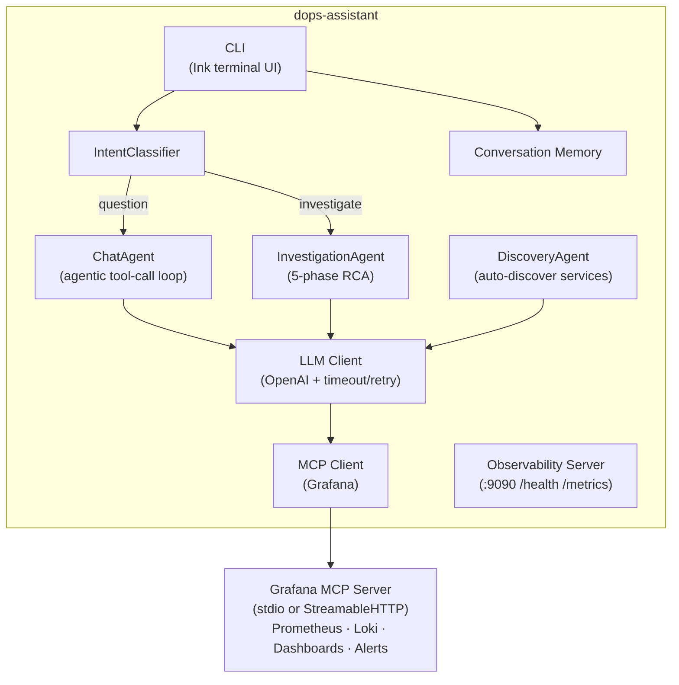

# dops-assistant

An agentic infrastructure monitoring assistant that connects to Grafana via MCP, proactively detects anomalies, performs autonomous root cause analysis, and serves as a conversational ops assistant through a terminal CLI.

## What it does

- **Conversational ops assistant** — ask questions in the CLI and get back specific metric values, log excerpts, and dashboard links
- **Service auto-discovery** — automatically discovers services via Consul metrics in Prometheus, probes for RED metrics and Loki log labels, and populates your config
- **Agentic tool use** — uses an LLM (OpenAI GPT-4 or compatible) in an agentic loop, calling Grafana MCP tools as needed to answer each question or check each service
- **Conversation memory** — conversations in the CLI retain context across turns within a session

## Architecture



The **CLI** classifies incoming messages via **IntentClassifier** — investigation requests go to the **InvestigationAgent** (5-phase parallel RCA pipeline), questions go to **ChatAgent** (agentic tool-call loop). **DiscoveryAgent** auto-discovers services via Consul/Prometheus at startup or via `npm run discover`. All LLM/tool calls have timeouts, retries, and Prometheus metrics. See [docs/architecture.md](docs/architecture.md) for a full component walkthrough.

## Prerequisites

- **Node.js 20+**
- **A running Grafana instance** with a service account token
- **An OpenAI API key** (or a compatible endpoint)

## Quick start

```bash
# 1. Install dependencies
npm install

# 2. Copy the example config and fill in your values
cp config.yaml.example config.yaml

# 3. Set environment variables (or use a .env loader)
export OPENAI_API_KEY=sk-...
export GRAFANA_SERVICE_ACCOUNT_TOKEN=glsa_...

# 4. (Optional) Auto-discover services from Consul/Prometheus
npm run discover

# 5. Run the CLI
npm run cli

# 6. Or build and run in production
npm run build && npm start
```

The config path defaults to `config.yaml` in the working directory. Override with `CONFIG_PATH=/path/to/config.yaml`.

## Configuration

| Section | Purpose |
|---|---|
| `llm` | Model, API key, token limit, optional custom base URL |
| `grafana.mcpServer` | MCP transport (`stdio` or `http`), command/URL, enabled tools |
| `services` | Services to monitor — PromQL queries and Loki log labels per service |
| `discovery` | Auto-discovery settings — `autoRefresh`, `excludeServices`, `consulMetric` |
| `agent` | Max agentic loop iterations, conversation memory size and TTL |

See [docs/runbook.md](docs/runbook.md) for a full annotated configuration reference and Grafana setup guide.

## Documentation

- [docs/architecture.md](docs/architecture.md) — component walkthrough and design decisions
- [docs/runbook.md](docs/runbook.md) — Grafana MCP setup, full config reference, tuning, troubleshooting

## License

MIT
