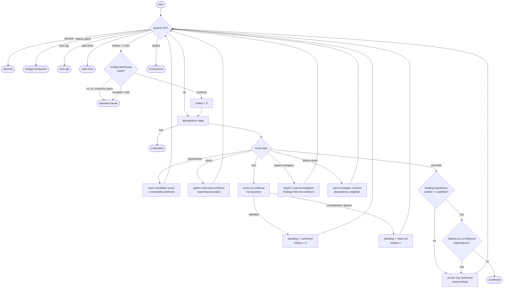
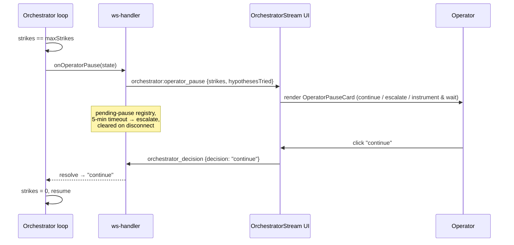
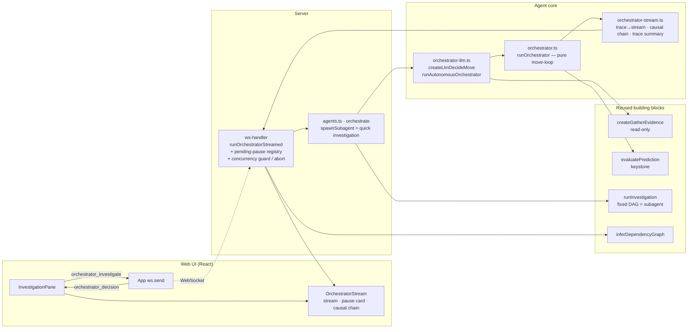

# Autonomous Orchestrator — the Agentic Loop

## Overview

The **autonomous orchestrator** (Approach D) is an agent that investigates an
incident for its *real* root cause by running an unbounded, read-only
**move-loop** — hypothesize, gather evidence, test, follow the cause across
service boundaries — until it either deterministically confirms a cause or a
safety guard stops it.

It is a **new agent that WRAPS the fixed investigation DAG**, it does not replace
it. Where the bounded investigation (`InvestigationRunner` → the
planning/metrics/logs/infra/synthesis workflow) runs a fixed pipeline once, the
orchestrator decides its *next move* each turn and can spawn the fixed
investigation as a depth-1 **subagent** scoped to a sub-question. Deep mode
re-judges an existing report's ruled-out hypotheses; the orchestrator goes
further — it can pivot, follow dependencies, and assemble a cross-service causal
chain.

It is **gated off** by default (`config.agent.autonomousInvestigationEnabled`, default
`false`) and is internal until validation (increment 7) completes.

| | Bounded investigation | Deep mode | Autonomous orchestrator |
|---|---|---|---|
| Shape | Fixed DAG, one pass | Re-test ruled-out causes | Unbounded decide→act move-loop |
| Cross-service | No | No | Yes (follow-cause via the dependency graph) |
| Stop signal | End of pipeline | End of re-test set | Deterministic keystone **or** a guard |
| Cost | 1× | ~1× | 3–10× (guarded) |

---

## The two decisions that define it

**DECISION 1 — Hybrid stop (the keystone).** The agent may *propose* `conclude`,
but the loop only actually stops on a `conclude` when the leading hypothesis is
**deterministically confirmed** by the corroboration keystone
(`evaluatePrediction` → verdict `satisfied`). The LLM's self-reported confidence
is recorded in the trace but is **never** the gate. Self-confidence can *direct*
the search; it can never *end* it.

**DECISION 2 — Safety harness.** Every other way the loop ends is a hard,
config-tunable guard (budget / depth / strikes / tool-cap / wall-clock / per-op
watchdog / abort), plus a stall detector and an absolute move backstop. Hitting
the **strike limit** is a first-class `operator-pause` outcome — the agent hands
an ambiguous call back to a human rather than guessing.

---

## The move loop

Each turn the agent's brain (`decideMove`, an LLM in prod, scripted in tests)
picks exactly one move from the read-only state. The loop checks the safety
guards **before** spending the move, dispatches the move, records a trace entry,
and repeats.



### The loop in pseudocode

The same loop as `runOrchestrator` (`src/agents/orchestrator.ts`), condensed.
Note the order: **guards are checked at the top of every iteration, before the
next move is spent**, and `conclude` only ends the run when the deterministic
keystone agrees (DECISION 1) — self-reported confidence never does.

```text
function runOrchestrator(deps):
    state = { hypotheses: [], evidence: [], dependencies, followedServices: {} }
    strikes = tokensSpent = toolCalls = moves = stall = operatorContinues = 0

    while moves < MAX_MOVES:                       # absolute backstop (1000)

        # ── 1. Safety harness (DECISION 2) — checked BEFORE spending a move ──
        if deps.signal.aborted:        return finish("aborted")        # operator disconnected
        if tokensSpent >= maxTokens:   return finish("budget-exhausted")
        if toolCalls   >= maxToolCalls:return finish("tool-cap")
        if elapsed()   >= wallClockMs: return finish("wall-clock")
        if strikes     >= maxStrikes:                                  # N causes ruled out
            if onOperatorPause and operatorContinues < MAX_OPERATOR_CONTINUES:
                decision = await onOperatorPause(state)   # increment 5 — BLOCKS on a human
                if decision == "continue":
                    operatorContinues += 1
                    strikes = 0
                    continue                              # resume; other guards still bound it
            return finish("operator-pause")               # escalate / wait / timeout / no hook
        if stall >= MAX_STALL:         return finish("inconclusive")   # no progress (8)

        # ── 2. The agent's brain picks ONE move ──
        move = await deps.decideMove(state)        # LLM in prod, scripted in tests
        if move == null:               return finish("exhausted")
        moves += 1
        tokensSpent += estimateTokens(move)

        # ── 3. Act on the move ──
        switch move.type:
            case "hypothesize":
                hypotheses.add(move.hypothesis)                  # + a checkable prediction
                stall = 0

            case "query":
                obs = watchdog(gatherEvidence(h), opTimeoutMs)   # read-only; bounded
                evidence += obs;  toolCalls += 1
                stall = obs.empty ? stall + 1 : 0

            case "test":                                         # the keystone — deterministic
                verdict = evaluate(h.prediction, evidence)
                if verdict == "satisfied":  h.standing = "confirmed";  strikes = 0
                else:                       h.standing = "ruled-out";  strikes += 1

            case "spawn-subagent" | "follow-cause":              # follow-cause: known dep only
                followedServices.add(move.service)
                evidence += watchdog(spawnSubagent(move.service), opTimeoutMs)

            case "conclude":                                     # DECISION 1 — hybrid stop
                if lead.standing == "confirmed" and lead.lastVerdict == "satisfied":
                    if lead names a dependency NOT in followedServices:   # inc-7 guard
                        record("not confirmed — investigate that dep first");  stall += 1
                    else:
                        return finish("confirmed", lead)
                else:
                    # self-reported confidence is recorded for the trace, never the gate
                    stall += 1

    return finish("inconclusive")                  # hit the move backstop
```

### Moves

| Move | Effect |
|---|---|
| `hypothesize` | Add a candidate root cause with a **structured, checkable** `prediction` (metric-threshold / log-pattern / infra-status / change-in-window). |
| `query` | Gather read-only evidence for a hypothesis's prediction (one MCP query, watchdog-bounded). |
| `test` | Score a hypothesis against gathered evidence via the deterministic keystone → `satisfied` resets strikes & marks `confirmed`; `contradicted`/`absent` marks `ruled-out` & increments strikes. |
| `conclude` | *Propose* done. Gated by DECISION 1 (keystone) + the cross-service guard. |
| `spawn-subagent` | Run a depth-1 scoped sub-investigation (the `quick` template) on a service; its conclusion folds back as one observation. |
| `follow-cause` | Like spawn-subagent, but **grounded**: the target MUST be a dependency-graph neighbor of the incident service, so the agent can't wander to arbitrary services. |

The loop never throws on a bad move — unknown/out-of-range targets are traced and
skipped, so a confused LLM degrades to `inconclusive`/`exhausted` rather than
crashing.

---

## Safety harness (DECISION 2)

Guards are checked at the top of every iteration, before the next move is spent,
so a tripped limit never does "one more" expensive thing.

| Guard | Default | Outcome on trip |
|---|---|---|
| Abort signal (operator disconnected) | — | `aborted` |
| Token budget (`maxTokens`) | 150,000 | `budget-exhausted` |
| Tool-call cap (`maxToolCalls`) | 40 | `tool-cap` |
| Wall-clock (`wallClockMs`) | 10 min | `wall-clock` |
| Consecutive rule-outs (`maxStrikes`) | 3 | `operator-pause` (interactive — see below) |
| Stall (no progress) | 8 moves | `inconclusive` |
| Subagent cap (`maxSubagents`) | 3 | move skipped |
| Per-operation watchdog (`opTimeoutMs`) | 150 s | gather/subagent abandoned (no findings), loop continues |
| Move backstop (`MAX_MOVES`) | 1000 | `inconclusive` |

The **per-op watchdog** bounds a single hung MCP/LLM call so it can't strand the
loop *between* guard checks. The **abort signal** is checked each move and is
wired so a WebSocket disconnect stops the run instead of letting it run on
headless with no one watching.

---

## Increment 5 — interactive operator-pause

When the loop hits `maxStrikes` (N candidate causes tested and ruled out, nothing
discriminating found), it does not silently stop. It emits a WebSocket prompt and
**blocks on a human decision**:

- **continue** → reset the strike counter and resume (the other guards still
  bound the resumed run). Capped at `MAX_OPERATOR_CONTINUES` (3) so a hung or
  perpetually-continuing operator can't spin the loop forever.
- **escalate to on-call** → stop with that disposition.
- **instrument & wait** → stop with that disposition.

In v1, escalate / wait have no backend (no paging, no scheduler) — they record
the disposition in the banner. A 5-minute timeout (or a disconnect) defaults to
`escalate` so a closed tab never strands the loop.



---

## Cross-service: follow-cause + the false-confirm guard

The incident service's dependency-graph neighbors (resolved via
`inferDependencyGraph`, both directions) are threaded into the loop as the only
services `follow-cause` may enter. After a follow-cause returns findings, the
agent is prompted to turn them into a tested hypothesis rather than stop on the
bare lead.

**False-confirm guard (increment 7).** Observing that a dependency is *unhealthy*
is correlational, not causal. So a `conclude` that names a dependency the agent
**never followed-cause'd into** is rejected ("blames X but never investigated
it") and the loop keeps looking. Mentions of the incident service's own behaviour
are fine. This is what stops a confident-but-wrong RCA like "checkout is down due
to a degraded payment-service" when payment-service was never actually examined.

---

## Output: causal chain + trace

On a finished run the orchestrator produces two headline artifacts beyond the
move log:

- **Causal chain** — ordered cause→effect with **source attribution**:
  `incident service → each followed dependency (+ the finding that pointed there)
  → root cause (+ the prediction the keystone confirmed)`. Rendered as a vertical
  stack; a service followed more than once is one link, not a repeated hop.
- **Trace summary** — a one-line run trace, e.g.
  `12 moves · 5 queries · 2 subagents · confirmed at depth 1`.

---

## Architecture & data flow

The core is a **pure, fully-injected control loop** (deterministic given a
deterministic `decideMove`) — unit-testable without an LLM or MCP. The real LLM
brain, evidence gather, keystone, subagent dispatch, and WebSocket streaming are
layered around it.



| Layer | File | Responsibility |
|---|---|---|
| Pure core | `src/agents/orchestrator.ts` | `runOrchestrator` — move-loop, guards, hybrid stop, operator-pause hook, watchdog, abort, cross-service guard. No LLM/MCP. |
| LLM brain + runner | `src/agents/orchestrator-llm.ts` | `createLlmDecideMove` (generateText + JSON parse — no tools/responseFormat, sidesteps the gpt-oss quirk) + `runAutonomousOrchestrator` wiring decide / gather / keystone / subagent / deps / signal. |
| Trace → UI | `src/agents/orchestrator-stream.ts` | `traceEntryToStreamEvent`, `assembleCausalChain`, `traceSummary`. |
| Adapter | `src/server/agents.ts` | `orchestrate` closure — reuses investigation providers + model; `spawnSubagent` runs the `quick` template read-only; `DEFAULT_ORCHESTRATOR_GUARDS`. |
| WebSocket | `src/server/ws-handler.ts` | `handleOrchestratorInvestigate` + `runOrchestratorStreamed`; pending-pause registry, per-connection concurrency guard, abort-on-disconnect; resolves dependency neighbors. |
| UI | `src/web/components/OrchestratorStream.tsx` (+ shared `AgentStream.tsx`) | Live move stream, working indicator, outcome banner, operator-pause card, causal-chain card, trace summary. |

---

## Outcomes

| Outcome | Meaning |
|---|---|
| `confirmed` | Hybrid stop — leading hypothesis deterministically `satisfied` (and not a guard-rejected cross-service claim). |
| `operator-pause` | Strike limit reached; handed to a human (or escalate/wait/timeout). |
| `budget-exhausted` / `tool-cap` / `wall-clock` | A resource guard tripped. |
| `exhausted` | The brain signalled no further moves. |
| `inconclusive` | Stalled (no progress) or hit the move backstop. |
| `aborted` | Caller aborted (e.g. the operator disconnected). |

---

## Protocol

**Client → server:** `orchestrator_investigate { investigationId }`,
`orchestrator_decision { investigationId, decision }`.

**Server → client:** `orchestrator:started`, `orchestrator:step { event }`,
`orchestrator:operator_pause { strikes, hypothesesTried }`,
`orchestrator:complete { outcome, stats, causalChain, traceSummary }`,
`orchestrator:error`.

---

## Configuration

```yaml
agent:
  autonomousInvestigationEnabled: false   # master gate; default off (internal until inc-7 validation)
```

Guards default conservatively (`DEFAULT_ORCHESTRATOR_GUARDS` in
`src/server/agents.ts`) because an autonomous run costs 3–10× a normal
investigation; the budget guard is the cost backstop.
